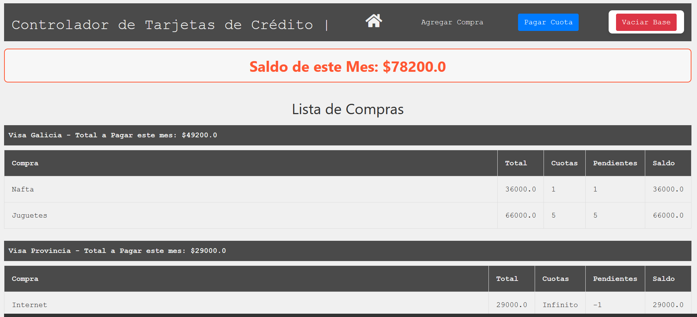
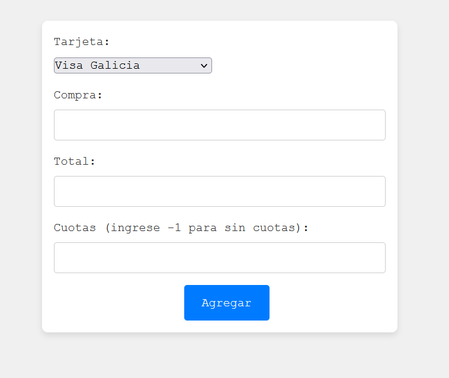

# Control de gastos de tarjeta
***
Este proyecto permite llevar un control de los gastos en tarjeta que uno tiene. Se encuentran hardcodeadas las tarjetas disponibles, eso es configurable por el momento modificando el siguiente código en app.py:

~~~
@app.before_first_request
def crear_tarjetas():
    tarjetas = ['Visa Galicia', 'Visa Provincia', 'Mastercard Galicia', 'Mastercard Provincia']
~~~

## ¿Cómo se usa?
### Visualización
En la barra de navegación se puede **Agregar Compra**, **Pagar Cuota**, **Vaciar Base**
Muestra el saldo mensual total, desagregado tarjeta por tarjea. En la base muestra el saldo total adeudado.

### Nueva compra
Yendo a la opción **Agregar Compra** se accede a la siguiente visual donde tras completar los campos y oprimir en **Agregar* se podrá cargar un nuevo gasto en la tarjeta seleccionada. 
Automáticamente enviará al index mostrando la nueva compra.
El sistema permite gastos perennes, ingresando -1 en el atributo **Cuotas**

### Pagar Cuota
La opción **Pagar Cuota** descuenta una cuota de cada compra.

### Vaciar Base
Se puede borrar toda la base, esto elimina todos los registros. **MÁXIMO CUIDADO**